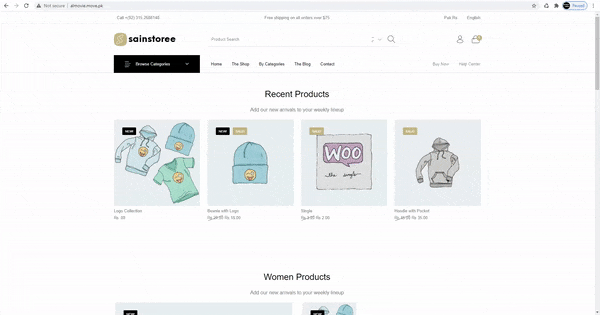

# [Woocommerce with React](https://github.com/shehzadali110/woo-react) :rocket:

> This is a React WooCommerce theme, built with React JS, Webpack, Babel, Woocommerce Api

## Important Note ⭐:
This code is using in live site. if you want to use it so please change the UI/UX.

## Live Sites:

* [Wp Site](http://sainstore.move.pk/)
* [React Site](http://almovie.move.pk/)

## Demo Desktop :video_camera:



# Features:

1. WooCommerce Store in React( contains: Products Page, Single Product Page, AddToCart, CartPage ).
2. Hot Reloading
3. Prefetching
4. Woocommerce Api (http://woocommerce.github.io/woocommerce-rest-api-docs)
5. WP API Menus (https://wordpress.org/plugins/wp-api-menus/)

## Getting Started :rocket:

These instructions will get you a copy of the project up and running on your local machine for development purposes.

### Installing :wrench:

1. Clone this repo using terminal `git clone git@github.com:shehzadali110/woo-react`
2. `cd woo-next`
3. `npm install Or yarn install`

## Add the following plugins in your WordPress site.

1. Woocommerce Api (http://woocommerce.github.io/woocommerce-rest-api-docs)
2. WP API Menus (https://wordpress.org/plugins/wp-api-menus/)
3. Download and activate:

* You can also import default wooCommerce products that come with wooCommerce Plugin for development ( if you don't have any products in your WordPress install ) `WP Dashboard > Tools > Import > WooCommerce products(CSV)`: The WooCommerce default products csv file is available at `wp-content/plugins/woocommerce/sample-data/sample_products.csv`

## Configuration Setup :wrench:

* _Note_ Below is for changing the wordpress rest api endpoint implementation. 
  Location: `wp-content/themes/yourTheme/functions.php`
   
```ruby

    flush_rewrite_rules(true);
    add_filter( 'rest_url_prefix', 'api_slug');
    function api_slug( $slug ) {
        return 'api';
    }
    
```

* _Note_ Below is for apply the woocommerce rest api implementation. 
  Location: `https://domainName.com/wp-admin/admin.php?page=wc-settings&tab=advanced&section=keys`

```ruby
    clicked on Add Key
```

## Author :bust_in_silhouette:

* **[Shehzad Ali](https://github.com/shehzadali110/)**

## License :page_with_curl:

This project is licensed under the MIT License - see the [LICENSE.md](LICENSE.md) file for details
